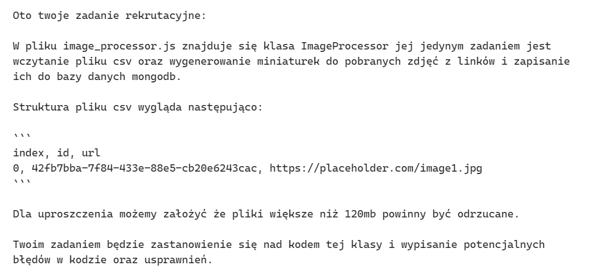

# Recruitment task Droplo



## Description

Code provided: 

```javascript
const fs = require('fs');
const path = require('path');
const { default: axios } = require('axios');
const { chunk } = require('lodash');
const sharp = require('sharp');
const mongoose = require('mongoose');

mongoose.connect(process.env.MONGO_URI, { useNewUrlParser: true, useUnifiedTopology: true });

const ImageSchema = new mongoose.Schema({
    id: { type: String, required: true },
    index: { type: Number, required: true },
    thumbnail: { type: Buffer, required: true },
});

const ImageModel = mongoose.model('Image', ImageSchema);

class ImageProcessor {
    constructor() {
        this.logger = console;
    }

    async start() {
        const batchSize = parseInt(process.env.DEFAULT_BATCH_SIZE, 10);
        const filePath = path.join(__dirname, `data/data.csv`);
        const data = fs.readFileSync(filePath, 'utf-8');
        const rows = this.parseCSV(data);

        this.logger.info(`Batch size: ${batchSize}`);
        this.logger.info(`Items: ${rows.length}`);

        const rawList = rows.map(row => ({
            index: row.index,
            id: row.id,
            url: row.url,
            thumbnail: null,
        }));

        const chunks = chunk(rawList, batchSize);

        this.logger.info("Starting batch...");

        for (const chunk of chunks) {
            try {
                const images = await this.processChunk(chunk, batchSize);

                await ImageModel.insertMany(images, { ordered: false });

                this.logger.info(`Processed batch size: ${images.length}`);
                this.logger.info(`Last processed index: ${chunk[chunk.length - 1].index}, Last processed ID: ${chunk[chunk.length - 1].id}`);

                if (global.gc) global.gc();
            } catch (error) {
                this.logger.error(`Error processing batch: ${error.message}`);
            }
        }
    }

    async processChunk(rawEntities, batchSize) {
        const tasks = rawEntities.map(rawEntity => this.createThumbnail(rawEntity));

        return Promise.all(tasks);
    }

    async createThumbnail(rawEntity) {
        try {
            const response = await axios.get(rawEntity.url, { responseType: 'arraybuffer' });
            const buffer = await sharp(response.data)
                .resize(100, 100)
                .toBuffer();

            rawEntity.thumbnail = buffer;
            delete rawEntity.url;
            return rawEntity;
        } catch (error) {
            this.logger.error(`Error creating thumbnail for ID ${rawEntity.id}: ${error.message}`);
            return null;
        }
    }

    parseCSV(data) {
        const rows = data.split('\n');
        const headers = rows.shift().split(',');
        return rows.map(row => {
            const values = row.split(',');
            return headers.reduce((obj, header, index) => {
                obj[header.trim()] = values[index]?.trim();
                return obj;
            }, {});
        });
    }
}

module.exports = ImageProcessor;
```

# ROZWIAZANIE
## Wprowadzone Usprawnienia 

### 1. Architektura i Struktura Projektu
- Przekonwertowano projekt na TypeScript dla lepszej kontroli typów i wykrywania błędów
- Wprowadzono modułową strukturę projektu z wydzielonymi:
  - `/schemas` - schematy MongoDB
  - `/models` - modele danych
  - `/types` - definicje typów TypeScript
  - `/utils` - narzędzia pomocnicze

### 2. Obsługa Błędów i Walidacja
- Dodano szczegółową walidację pliku CSV
- Dodano walidację URL-i obrazów
- Wprowadzono system śledzenia nieudanych prób przetwarzania obrazów
- Dodano mechanizm ponownych prób dla nieudanych operacji
- Zaimplementowano limit rozmiaru pliku (120MB)
- Wprowadzono logowanie błędów przy użyciu Winston zamiast console.log

### 3. Zarządzanie Danymi
- Wprowadzono mechanizm wykrywania i aktualizacji istniejących obrazów
- Dodano osobną kolekcję dla nieudanych prób przetwarzania
- Zaimplementowano indeksy w MongoDB dla lepszej wydajności
- Dodano czyszczenie nieaktualnych rekordów
- Wprowadzono przetwarzanie wsadowe (batch processing)

### 4. Optymalizacja Wydajności
- Zastosowano strumieniowe przetwarzanie CSV dla lepszej wydajności pamięci
- Dodano konfigurowalny rozmiar wsadu (batch size)
- Zoptymalizowano operacje bazodanowe
- Wprowadzono równoległe przetwarzanie obrazów w ramach wsadu

### 5. Konteneryzacja
- Dodano konfigurację Docker
- Wprowadzono docker-compose dla łatwego uruchomienia środowiska
- Skonfigurowano osobne środowiska dla developmentu i testów

### 6. Konfiguracja
- Wprowadzono zmienne środowiskowe
- Dodano konfigurowalny logger
- Umożliwiono dostosowanie parametrów przetwarzania

## Uruchomienie Projektu

### Development
```bash
# Install Dependecies
npm install

# DEVELOPER MODE #
# Setup mongo
-
# Starting dev server 
npm run dev

# DOCKER #
# Starting a Docker
npm run docker:up